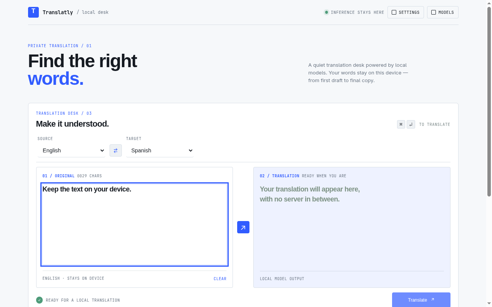
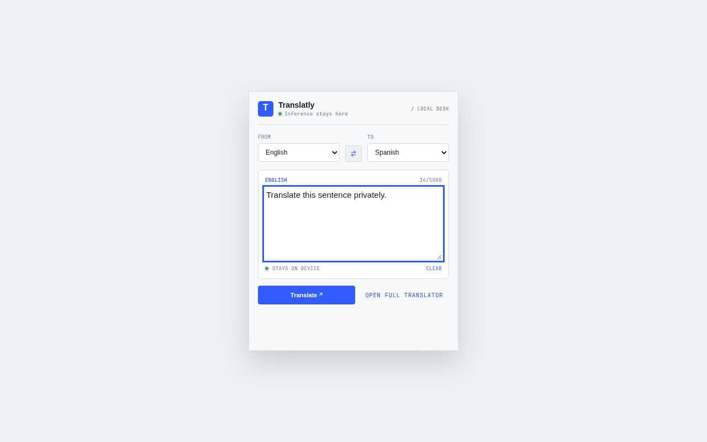
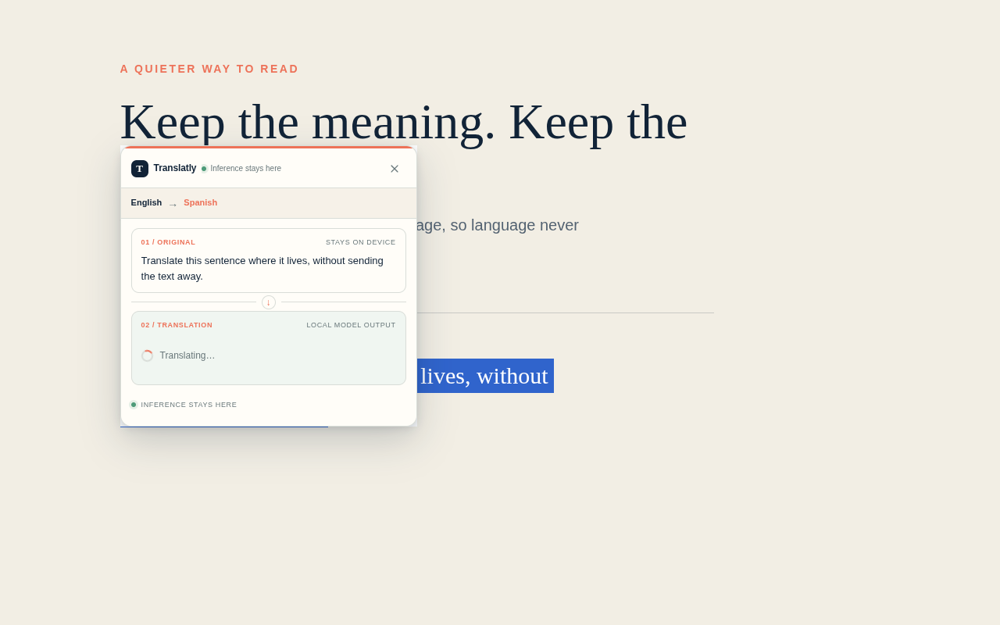

# Translatly

[](https://github.com/JorgeDelgadillo/translatly/actions/workflows/tests.yml)
[](https://github.com/JorgeDelgadillo/translatly/releases)
[](./LICENSE)

Privacy-first translation for the browser. Translatly runs quantized neural
translation models locally in Chromium and Firefox, so translation text stays
on your device.

<p align="center">
  
</p>

## Features

- Translate selected text with an inline bubble on any web page.
- Translate quickly from the popup using saved language preferences.
- Use a full-page translator with history, language detection, settings, themes, and model management.
- Run inference locally with ONNX Runtime Web and quantized Transformers.js models.
- Download model data on demand; translation text is never sent to a translation service.
- Use the curated language set: English, Spanish, French, German, Italian, and Portuguese.
- Use direct OPUS-MT models for English<->Spanish and English<->French, with the NLLB fallback for the remaining curated pairs.
- Run Chromium MV3 and Firefox MV2 builds from one WXT codebase.

## Model Downloads

Model files are not committed to this repository. They are downloaded only when
you request a route:

- Direct OPUS-MT routes use compact pair models such as [`Xenova/opus-mt-en-es`](https://huggingface.co/Xenova/opus-mt-en-es).
- Other curated language pairs use [`Xenova/nllb-200-distilled-600M`](https://huggingface.co/Xenova/nllb-200-distilled-600M) as the local fallback.

Review the license and terms on each model card before redistributing model
files. The MIT license in this repository applies to Translatly source code,
not to third-party models or dependencies.

## Screenshots

<p align="center">
  
</p>

<p align="center">
  
</p>

Additional Chrome Web Store assets are available in [`store-assets/`](./store-assets/).

## Privacy

Translatly handles text only after you explicitly request a translation. Text,
results, and history stay on the device. The only network access is downloading
model data from Hugging Face when you request a model; the extension does not
send translation text, use telemetry, or load remote executable code.

Read the complete [Privacy Policy](./PRIVACY.md).

## Requirements

- Node.js 22 or newer
- pnpm 10 or newer
- Chromium or Firefox for running the extension
- A graphical Chromium session for the optional real-model smoke test

## Development

Install dependencies and prepare the generated extension assets and WXT types:

```sh
pnpm install
pnpm run setup:extension
```

Start development mode:

```sh
pnpm dev              # Chromium MV3
pnpm dev:firefox      # Firefox MV2
```

Load the generated unpacked extension from `.output/chrome-mv3` or
`.output/firefox-mv2` when WXT does not open the browser automatically.

Useful checks and packages:

```sh
pnpm check
pnpm test:unit
pnpm test:e2e
pnpm build
pnpm build:firefox
pnpm zip
pnpm zip:firefox
```

The first Playwright run may require the browser binary:

```sh
pnpm exec playwright install chromium
```

The real-model smoke test is intentionally manual because it downloads a
production model:

```sh
pnpm test:smoke:model
```

See [`docs/REAL-MODEL-SMOKE.md`](./docs/REAL-MODEL-SMOKE.md) for requirements
and timeout options.

## Installation

Release packages are generated by GitHub Actions when a GitHub Release is
published. Download the Chrome or Firefox package from the release assets and
follow the [manual installation guide](./docs/INSTALL.md).

For private Chrome Web Store testing, upload the Chrome package in the
[Developer Dashboard](https://chrome.google.com/webstore/devconsole/), set
visibility to **Private**, and add trusted tester accounts.

## Architecture

```text
Popup / translator / content bubble
        |
        v
Background coordinator
        |
        +--> Chromium MV3 offscreen engine host
        |
        +--> Firefox MV2 background engine host
        |
        v
Serial translation and model queue
        |
        v
Local Transformers.js + ONNX Runtime Web
```

The extension has three user surfaces:

- `src/entrypoints/popup`: quick translations.
- `src/entrypoints/translator`: the full translation workspace.
- `src/entrypoints/content`: the Shadow DOM selection bubble.

The engine, messaging, storage, language registry, and model lifecycle code live
in `src/lib/`. Chromium and Firefox share the same product code while using the
platform-specific engine host required by each manifest version.

## Contributing

Read [CONTRIBUTING.md](./CONTRIBUTING.md) before opening a pull request. Please
keep changes focused, run the relevant checks, and never commit downloaded
models, generated build output, credentials, or store secrets.

Report security issues privately using the process in [SECURITY.md](./SECURITY.md).

## License

Translatly is released under the [MIT License](./LICENSE).
